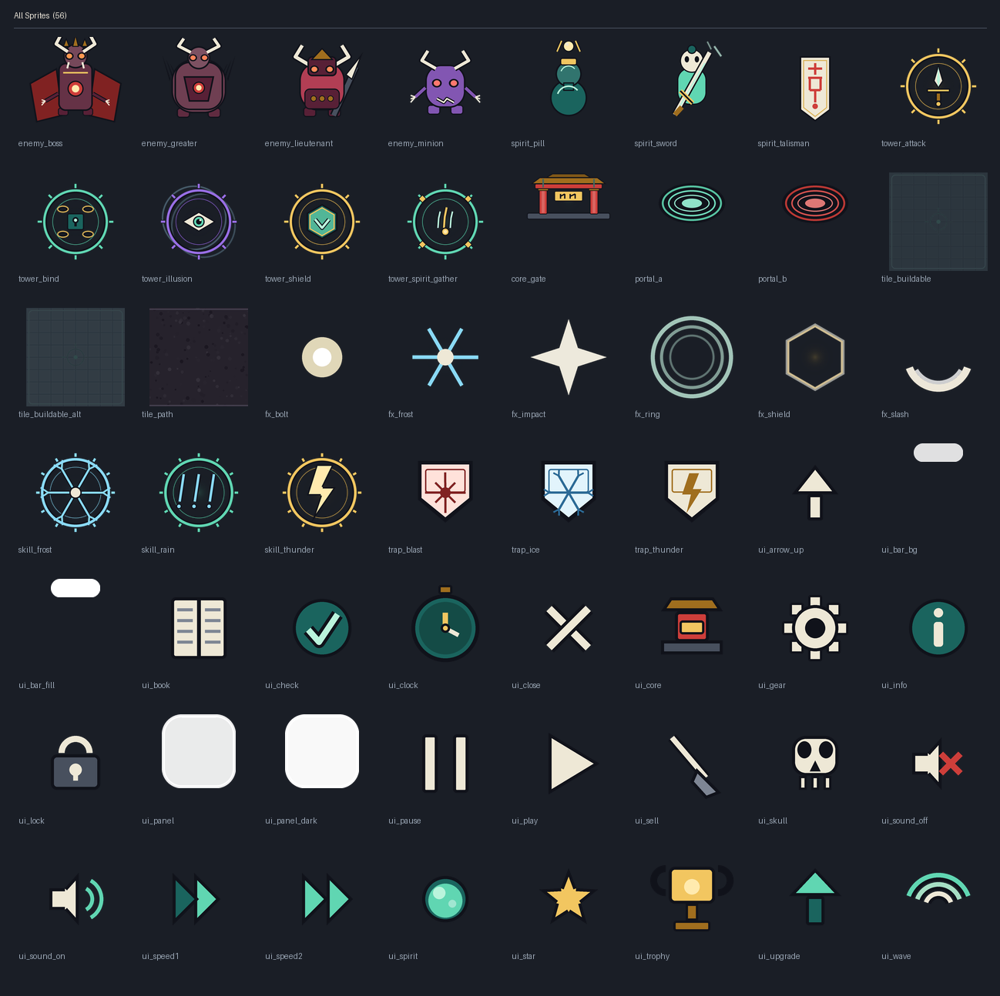

# 仙侠 · 护山大阵

> 一款单机仙侠塔防。妖魔沿两条山路直扑山门，你在有限的地块上布阵、召灵、埋符，
> 在每一波之间抢时间扩张阵线，直到撑满最后一波。

**竖屏 · 单机 · 无广告 · 无内购 · 无联网请求。**
全部美术与音效都是程序化生成的（生成脚本就在仓库里），不含任何第三方素材。

---

## 目录

- [它是什么](#它是什么)
- [怎么跑起来](#怎么跑起来)
- [操作与玩法](#操作与玩法)
- [工程结构](#工程结构)
- [三层架构：为什么核心逻辑不依赖 Unity](#三层架构为什么核心逻辑不依赖-unity)
- [资源是生成的](#资源是生成的)
- [数值调整](#数值调整)
- [自测与工具](#自测与工具)
- [打包 Android](#打包-android)
- [已知限制](#已知限制)

### 文档

| 文档 | 内容 |
|---|---|
| [玩法与操作](docs/玩法与操作.md) | 目标、操作、三类布置物、终极技、节奏、成就、界面 |
| [架构说明](docs/架构说明.md) | 为什么这样分层、数据流、配置系统、模拟层内部、工具链、刻意的取舍 |
| [数值与平衡](docs/数值与平衡.md) | 全部数值表（自动生成）、平衡验收标准与调参记录 |
| [上手指南](docs/上手指南.md) | 环境准备、首次打开、不用 Unity 的验证方式、常见改动、踩坑清单 |
| [需求对照](docs/需求对照.md) | 逐条需求 → 代码位置的对照表，以及明确未做的部分 |

---

## 它是什么

| | |
|---|---|
| 引擎 | Unity 2022 LTS（Built-in 渲染管线，无任何第三方包） |
| 语言 | C# 7.3（比 Unity 支持的上限更保守，保证跨版本可编译） |
| 目标平台 | Android（竖屏），编辑器内可直接 Play |
| 玩法 | 塔防 / 布阵，3 个难度（10 / 15 / 20 波） |
| 内容 | 5 种阵法 · 3 种仙灵 · 3 种符箓 · 3 个终极技 · 4 类妖魔 · 10 个成就 · 58 张精灵图 · 22 个音频（全部脚本生成） |
| 存档 | 本地 PlayerPrefs，无需账号 |
| 工程量 | 游戏代码约 10,800 行 C#（纯逻辑 5,500 + 表现层 5,300），另有 2,400 行测试与工具、1,900 行 Python 生成脚本 |

**棋盘**：6 列 × 9 行。妖魔从上方两条山路进场（甲路 / 乙路），沿路摸到下方山门。
山门耐久归零即失守；撑满全部波次即守山成功。每 5 波是 BOSS 波，魔君带护盾、还会拆阵。

---

## 怎么跑起来

### 在 Unity 里直接玩

1. 用 Unity Hub 添加本目录（工程版本为 `2022.3 LTS`，其它 2022.3.x 小版本也可以）。
2. 首次打开时，编辑器脚本 [`Assets/Editor/ProjectBootstrap.cs`](Assets/Editor/ProjectBootstrap.cs)
   会自动生成主场景、配好包名与竖屏设置、并把贴图按 Sprite 重新导入。
   如果没自动跑，点菜单 **仙侠·护山大阵 → 一键配置工程**。
3. 打开 `Assets/Scenes/Main.unity`，点 **Play**。

> 嫌麻烦的话，其实**任意空场景按 Play 也能跑** —— 游戏入口用
> `[RuntimeInitializeOnLoadMethod]` 自启动，场景里连 Canvas 都不需要。

### 不出 Android 包也想改数值

核心玩法逻辑在 `Assets/Scripts/Core/`，**不依赖 UnityEngine**，可以用普通 .NET SDK 编译：

```bash
dotnet build tools/UnityCheck/UnityCheck.csproj     # 全工程类型检查（不需要 Unity）
dotnet run   --project tools/CoreTests/CoreTests.csproj   # 146 项核心逻辑自测
```

---

## 操作与玩法

### 操作

- **布置**：点下方卡牌选中 → 点棋盘落子；或者**按住卡牌拖到棋盘上松手**（两种都支持）。
- **升级 / 铲除**：点一下已建成的阵法，弹出操作面板。
- **终极技**：点卡片立即施放，有冷却。
- **暂停 / 二倍速**：右上角按钮；安卓返回键可以逐层退出（弹窗 → 选中 → 撤退提示）。
- **备战期**：每波之间有准备时间，点「开始」可以提前开战抢节奏。

### 三类可布置的东西

| 类别 | 放在哪 | 作用 |
|---|---|---|
| **阵法** | 空地 | 经济与输出的骨架：聚灵阵产灵气，攻击法阵打伤害，困阵减速，幻阵让妖魔打空，护盾阵替周围阵法挨打 |
| **仙灵** | 道路上 | 会自己迎击的召唤物，有存在时间：剑灵近战、符灵远程、丹灵持续修复山门耐久 |
| **符箓** | 道路上 | 埋下去看不见，妖魔踩到才触发：雷符单体高伤、冰符减速、爆符范围伤害 |

### 终极技

天雷咒（全屏雷击）、冰封（全屏强减速）、灵雨（修复山门耐久 + 回灵）。冷却独立计时。

### 成就

10 个，涵盖首战、三个难度通关、高耐久通关、经济、构筑广度、零漏怪、技能使用与累计场次。
触发条件是纯函数（`Core/SaveData.cs` 里的 `Achievements.Check`），因此可以脱离 Unity 做测试。

---

## 工程结构

```
MountainWardBarrier/
├── Assets/
│   ├── Scripts/
│   │   ├── Core/                 纯逻辑层：不 using UnityEngine，可独立编译测试
│   │   │   ├── BattleSimulation.cs   ★ 模拟器：波次、寻路、索敌、结算（约 1500 行）
│   │   │   ├── Entities.cs           妖魔 / 阵法 / 仙灵 / 符箓 / 弹道的运行时数据
│   │   │   ├── DataModels.cs         全部配置的数据模型与枚举
│   │   │   ├── DefaultConfig.cs      内置数值表（配置缺失时的兜底）
│   │   │   ├── ConfigLoader.cs       JSON 配置载入 / 导出（逐字段宽松覆盖）
│   │   │   ├── GridMap.cs            棋盘栅格化与寻路采样
│   │   │   ├── SaveData.cs           存档 / 战报 / 成就 / 埋点
│   │   │   ├── SimEvents.cs          模拟 → 表现的事件协议
│   │   │   ├── SimMath.cs            GridPos / Float2 / 数学工具
│   │   │   ├── SimRandom.cs          xorshift32 确定性随机
│   │   │   └── MiniJson.cs           手写 JSON（核心层不依赖 JsonUtility）
│   │   ├── Unity/                表现层：uGUI 界面与输入
│   │   │   ├── GameBootstrap.cs      ★ 入口：自建 Canvas / 相机 / EventSystem 与界面切换
│   │   │   ├── BattleScreen.cs       对局界面：HUD + 17 张卡牌 + 事件表现
│   │   │   ├── BoardView.cs          棋盘绘制：地砖、单位、血条、特效、飘字、震屏
│   │   │   ├── MenuScreen.cs         主界面（难度卡 + 纪录 + 统计）
│   │   │   ├── ResultScreen.cs       结算界面
│   │   │   ├── Overlays.cs           设置 / 成就 / 典籍 / 关于 / 新手引导
│   │   │   ├── UiKit.cs              uGUI 搭建工具箱（含对象池与字体降级）
│   │   │   ├── UiInteractions.cs     卡牌拖拽、棋盘点击、浮动提示
│   │   │   ├── SpriteLibrary.cs      三级兜底贴图加载
│   │   │   ├── AudioLibrary.cs       BGM 交叉淡入 + 音效轮转播放
│   │   │   ├── SaveSystem.cs         PlayerPrefs 存档 + 埋点落盘
│   │   │   ├── FpsCounter.cs         帧率显示（设置里可开）
│   │   │   └── Palette.cs            全局配色
│   │   └── Editor/
│   │       ├── ProjectBootstrap.cs   自动配置工程 + 贴图/音频导入规则
│   │       └── AndroidBuilder.cs     一键打包 APK（菜单 + 命令行两个入口）
│   ├── Resources/
│   │   ├── Config/game_config.json   ★ 数值配置表，改它即可调平衡（无需重编译）
│   │   ├── Sprites/{Units,Terrain,UI}/   58 张精灵图（生成）
│   │   └── Audio/{BGM,SFX}/              22 个音频（生成）
│   └── Scenes/                    主场景（由 Editor 脚本生成，不入库）
├── docs/                          玩法、架构、上手、数值与需求对照文档
├── tools/
│   ├── build_apk.bat              一键打包 APK（双击即可，产物在 Build\Android\）
│   ├── gen_sprites.py             精灵图生成器（Python + Pillow）
│   ├── gen_audio.py               音效 / BGM 生成器（纯 Python 合成，无需第三方库）
│   ├── gen_preview.py             把精灵图拼成预览图（README 里那两张）
│   ├── gen_doc_tables.py          从配置导出 Markdown 数值表（docs 用）
│   ├── CoreTests/                 核心逻辑自测 + 脚本机器人平衡测试
│   ├── UnityStubs/                UnityEngine / UnityEditor API 桩
│   └── UnityCheck/                无 Unity 环境下的全工程类型检查
└── ProjectSettings/ProjectVersion.txt   （其余设置由 Editor 脚本写入，见 .gitignore 说明）
```

---

## 三层架构：为什么核心逻辑不依赖 Unity

这是整个工程唯一一处"刻意的过度设计"，但它换来了三样很实在的东西。

```
        ┌──────────────────────────────────────────┐
        │  Unity 表现层  Assets/Scripts/Unity       │
        │  画出来 · 把手指变成指令 · 把事件变成音画   │
        └───────────────┬──────────────▲───────────┘
        指令（TryBuildTower …）        │ 事件（SimEvent 列表）
                        ▼              │
        ┌──────────────────────────────────────────┐
        │  纯逻辑模拟层  Assets/Scripts/Core        │
        │  不 using UnityEngine，可被普通 .NET 编译  │
        └──────────────────────────────────────────┘
```

1. **玩法可以脱离 Unity 验证。** `tools/CoreTests` 用 .NET SDK 直接编译 Core，
   跑 146 项断言：JSON 往返、存档、成就、寻路、确定性复现，以及**用脚本机器人试打三个难度**。
   改完数值跑一句 `dotnet run` 就知道有没有把游戏改坏。
2. **确定性可复现。** 模拟层自带 xorshift32（`SimRandom`），同一个 seed 必然得到同一局。
   战报里会记下 seed，出问题可以照着复现。表现层用的 `UnityEngine.Random` 只影响特效飘散方向。
3. **界面不依赖场景与预制体。** 没有 `.prefab`，没有对资源 GUID 的场景引用 ——
   所有控件都在运行时用 `UiKit` 搭出来。好处是从 git 拉下来就能跑，
   不会出现"XX 丢了 prefab 引用"这种经典事故。

数据流是单向的：

```
玩家操作 → BattleScreen 调 _sim.TryBuildTower(...)
         → 模拟层改状态并把 SimEvent 塞进 _sim.Events
         → 同一帧 BattleScreen.ConsumeEvents() 取出，播音效 / 放特效 / 弹飘字
         → BoardView.Sync() 每帧按当前状态重画棋盘（单位用 id 池复用图形对象）
```

### 配置的优先级

```
Resources/Config/game_config.json  ──(载入)──►  GameDatabase  ←── 内置 DefaultConfig.Build()
        ↑ 有就用它，逐字段宽松覆盖                    ↑
        └── 缺失 / JSON 写坏了 ────────────────────┘ 回退到代码里的默认值
```

`game_config.json` 由 `dotnet run --project tools/CoreTests export-config` 从代码默认值导出，
所以它和代码永远一致；改这个 JSON 改平衡性**不需要重新编译**。
即使玩家把它改烂了，游戏也只会打一条警告然后照常启动。

---

## 资源是生成的

仓库里没有一张"画"出来的图，也没有一个下载的音效。



*上图为全部 58 张精灵图（由 `tools/gen_preview.py` 从 `Assets/Resources/Sprites` 拼出）。
单位与地形的单独预览见 [`tools/_preview_units.png`](tools/_preview_units.png)。*

### 美术（`tools/gen_sprites.py`）

用 Pillow 在 4 倍超采样画布上画完再缩小，得到抗锯齿的边缘。
调色板是「玉青 + 鎏金」（我方）对「暗紫 + 妖红」（敌方），
和代码里的 `Palette.cs` 是同一套值。58 张图包括：

- 12 张单位图（5 阵法 / 3 仙灵 / 4 妖魔）
- 8 张地形图（地砖、山门、传送门、两张背景）
- 38 张 UI 图（面板九宫格、进度条、20 个图标、特效）

面板图刻意画成**白色**，颜色全部交给代码染色，这样一张图能当所有按钮的底。
`ui_panel` / `ui_bar_*` 在导入时会带上 9 宫格 border，拉伸不变形。

### 音频（`tools/gen_audio.py`）

纯 Python 合成，连第三方库都不需要：

- **BGM**：Karplus-Strong 拨弦合成古筝味，D 宫五声音阶，配合反馈延迟做空谷回声。
- **音效**：正弦 + 噪声塑形做打击音，包络决定是"叮"还是"轰"。

22 个文件，合计不到 2 MB。全部音频缺失时，`AudioLibrary` 还会在运行时合成一个提示音兜底。

---

## 数值调整

所有数值都在 `Assets/Resources/Config/game_config.json`（或代码里的 `Core/DefaultConfig.cs`）。
改完可以立刻用机器人验证：

```bash
dotnet run --project tools/CoreTests/CoreTests.csproj
```

最后一段会打印机器人试打结果，例如：

```
简单：机器人胜 3/3，平均推进到第 10.0 波，平均耗时 204 秒，平均建阵 21.0 座，平均漏怪 15.0 只
普通：机器人胜 3/3，平均推进到第 15.0 波，平均耗时 304 秒，平均建阵 24.0 座，平均漏怪 21.0 只
困难：机器人胜 0/3，平均推进到第 19.3 波，平均耗时 436 秒，平均建阵 27.0 座，平均漏怪 34.7 只
```

调试判据：**简单 / 普通必须能通关，困难要能推进到第 14 波以后**。
困难允许难，但不许"第 4 波就崩"——那是数值断层，不是难度。

详细的数值表与平衡曲线记录在 [docs/数值与平衡.md](docs/数值与平衡.md)。

---

## 自测与工具

| 命令 | 作用 |
|---|---|
| `dotnet run --project tools/CoreTests/CoreTests.csproj` | 146 项核心逻辑自测 + 三难度平衡试打 |
| `dotnet run --project tools/CoreTests/CoreTests.csproj export-config <路径>` | 从代码默认值导出配置 JSON |
| `dotnet build tools/UnityCheck/UnityCheck.csproj` | **不需要 Unity** 的全工程类型检查 |
| `tools\build_apk.bat` | 一键打包 Android APK（需要 Unity + 已激活许可） |
| `python tools/gen_sprites.py` | 重新生成 58 张精灵图 |
| `python tools/gen_audio.py` | 重新生成 22 个音频文件 |
| `python tools/gen_preview.py` | 把精灵图拼成两张预览图（README 用的就是它们） |
| `python tools/gen_doc_tables.py` | 从配置导出 Markdown 数值表，供 docs 使用 |

`tools/UnityCheck` 是本工程比较特别的一块：它把 `Assets/Scripts` 下的全部代码
连同 `tools/UnityStubs` 里手写的 UnityEngine / UnityEditor API 桩一起编译，
于是**没装 Unity 的机器也能查出拼错的成员名、参数个数不对、枚举与整数不能隐式互转**这类问题。
（它不是模拟器，跑不了游戏，只做静态检查。这套自检在开发中真抓出过 6 个编译错误。）

---

## 打包 Android

菜单 **仙侠·护山大阵 → 一键配置工程** 已经把下面这些都设好了：

- 包名 `com.qiaoqiao.mountainwardbarrier`，版本 1.0.0
- 竖屏锁定，最低 SDK 24，仅 ARM64（Google Play 要求）+ IL2CPP
- **关闭联网权限与外部存储权限**（`forceInternetPermission = false`）—— 这是"零联网请求"的一部分
- 色彩空间 Gamma，与生成素材时一致

### 一键打包（推荐）

双击 **`tools\build_apk.bat`** 即可。它自己会找 Unity.exe、切到 Android 平台、
关掉 `buildAppBundle`（否则出的是 .aab 而不是 APK），产物落在：

```
Build\Android\MountainWardBarrier.apk
Build\Android\build.log          ← 打包失败时把这个日志发出来
```

批处理用的是 Unity 的 `-batchmode -executeMethod`，命令行入口是
`Assets/Editor/AndroidBuilder.cs` 里的 `BuildFromCommandLine()`。
它先把 `ProjectBootstrap.EnsureConfigured()` 跑一遍 —— 因为批处理模式下
`EditorApplication.delayCall` 不保证执行，不显式配置的话场景没建、Build Settings 是空的，
打包会以看不懂的方式失败。

想从界面打包，用菜单 **仙侠·护山大阵 → 打包 Android APK** 效果完全一样。

### 前置条件

1. **Unity 许可已激活。** Unity 不给没激活的编辑器打包，这一步无法脚本化：
   打开 Unity Hub → 登录 → 激活 Personal（免费版）即可。
   注意 Unity 官方已停止 Personal 的手动激活（`.alf`/`.ulf`）流程，只能走 Hub 登录。
2. **Android 模块齐全。** 需要 SDK（含 `platforms` + `build-tools`）、NDK、OpenJDK 三样，
   缺一样打包都会失败。菜单 **配置 Android 打包路径** 会自动探测并接通，
   跑完会弹一个摘要告诉你三条路径都是什么。
3. 打包前 `Edit → Preferences → External Tools` 里三条路径应当都非空。

首次 IL2CPP 打包比较慢（十几分钟量级），之后增量会快很多。

APK 里没有任何广告 / 统计 SDK，也没有网络请求代码。

---

## 已知限制

- **本仓库不含 ProjectSettings 与 .meta。** 这是刻意的：那些文件机器生成、易冲突。
  所有必要设置都由 `Assets/Editor/ProjectBootstrap.cs` 在首次打开时写入，可重复执行。
- **主场景不入库**，由 Editor 脚本生成（场景里其实只有一个空对象）。
- **困难难度未通关。** 机器人打不过第 19 波（20 波制的收官 Boss 波），
  这是有意留的挑战空间，不是没调完。
- **中文字体靠系统提供。** `UiKit` 会按「微软雅黑 → Noto Sans CJK → 源黑」的顺序向操作系统要字体；
  安卓 ROM 基本都自带 Noto Sans CJK，但如果遇到极小众 ROM 缺中文字体，界面文字会退化成方块。
- **没有云存档、没有排行榜、没有联机。** 需求里就没有，也不打算有。

---

## 许可

MIT，见 [LICENSE](LICENSE)。
素材、音效、代码全部由本仓库内的脚本生成 / 编写，可自由使用与修改。
